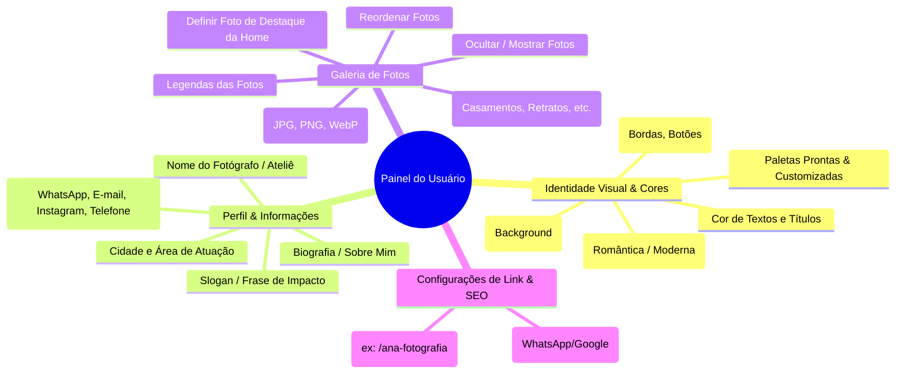
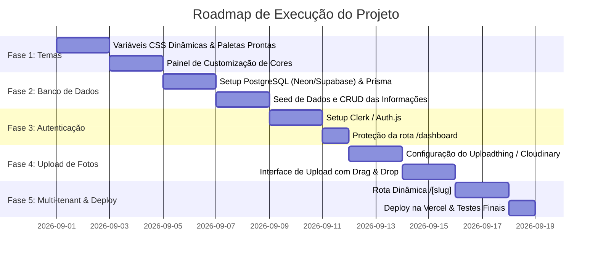

# 📘 Documentação de Arquitetura & Roadmap: Plataforma de Portfólios

Esta documentação serve como guia mestre para escalar o portfólio de fotografia em uma plataforma **multi-tenant moderna, com custo zero ($0)**, onde cada usuário/fotógrafo tem seu próprio link, painel de customização de cores, perfil e upload de fotos.

---

## 🎯 1. O que o Usuário Terá Direito de Editar

O painel administrativo (`/dashboard` ou `/admin`) dará controle total aos seguintes módulos:



### Detalhamento dos Campos Editáveis:

| Módulo | Campo | Descrição |
| :--- | :--- | :--- |
| **Identidade Visual** | `paletteId` | Selecionar um tema base pré-definido ou personalizar. |
| | `bgPrimary` | Cor de fundo principal da página (ex: `#fff7f7`). |
| | `bgTint` | Cor de fundo das seções alternadas (ex: `#fef0f2`). |
| | `accentColor` | Cor de botões, ícones, detalhes e tags (ex: `#e28294`). |
| | `textColor` | Cor dos parágrafos e textos corridos (ex: `#382a2c`). |
| | `headingFont` | Estilo da tipografia dos títulos (ex: *Caligráfica/Scrapbook*, *Serifada Elegante*, *Moderna Sans*). |
| **Perfil** | `name` | Nome exibido no topo e rodapé. |
| | `tagline` | Frase curta de impacto no Hero. |
| | `bio` | Texto descritivo da seção "Sobre Mim". |
| | `city` | Cidade de atendimento. |
| | `whatsapp` | Número de WhatsApp com link direto de conversa. |
| | `instagram` | @ do Instagram com link direto. |
| | `email` | E-mail para contato profissional. |
| | `phone` | Telefone comercial exibido no rodapé/contato. |
| **Galeria** | `categories` | Criar, renomear e reordenar categorias de fotos. |
| | `photos` | Upload de arquivos reais (com prévia em tempo real). |
| | `featured` | Marcar qual foto fica em destaque no coração/topo. |
| | `order` | Ordem de exibição em cada álbum. |
| | `caption` | Legenda da foto / nome do ensaio. |
| | `selected` | Chave de visibilidade (mostrar ou ocultar sem apagar). |
| **Geral & Link** | `slug` | Link exclusivo (ex: `seusite.com/carol-fotografia`). |

---

## 🗂️ 2. Organização e Estrutura de Pastas Recomendada

A arquitetura do projeto segue o padrão **Next.js 15 App Router Fullstack**, dividindo claramente o que é público, o que é autenticado e a camada de dados.

```
portfolio_fotografa/
├── app/
│   ├── layout.tsx                 → Layout global com fontes e estilos base
│   ├── page.tsx                   → Landing page do produto (convite para fotógrafos criarem conta)
│   ├── [slug]/                    → ROTA PÚBLICA DINÂMICA (o portfólio de cada fotógrafo)
│   │   ├── page.tsx               → Busca os dados do slug e renderiza o tema/fotos daquele usuário
│   │   └── layout.tsx             → Injeta as variáveis de tema dinâmicas (<style> ou CSS Variables)
│   ├── dashboard/                 → PAINEL DO USUÁRIO (Autenticado)
│   │   ├── layout.tsx             → Sidebar e cabeçalho da área logada
│   │   ├── page.tsx               → Visão geral e estatísticas
│   │   ├── aparencia/page.tsx     → Editor de cores, fontes e tema em tempo real
│   │   ├── perfil/page.tsx        → Edição de bio, nome e redes sociais
│   │   ├── fotos/page.tsx         → Upload de fotos, organização e categorias
│   │   └── configuracoes/page.tsx → Escolha de slug e SEO
│   └── api/                       → ENDPOINTS & SERVER ACTIONS
│       ├── uploadthing/core.ts    → Handlers de upload de imagens
│       └── webhooks/              → Sincronização de usuários (ex: Clerk/Stripe)
│
├── components/
│   ├── public/                    → Componentes do portfólio público (Hero, AlbumSection, etc.)
│   │   ├── PublicPortfolio.tsx
│   │   ├── Hero.tsx
│   │   ├── AlbumSection.tsx
│   │   ├── PhotoFrame.tsx
│   │   └── ContactSection.tsx
│   ├── dashboard/                 → Componentes do painel do usuário
│   │   ├── ColorPicker.tsx        → Seletor de cores e paletas pré-configuradas
│   │   ├── LivePreview.tsx        → Preview do portfólio em tempo real enquanto edita
│   │   ├── ImageUploader.tsx      → Drag-and-drop de fotos
│   │   └── PhotoGridSortable.tsx  → Reordenação de fotos
│   └── ui/                        → Componentes reutilizáveis (Botões, Modais, Inputs)
│
├── lib/
│   ├── db.ts                      → Cliente Prisma (Singleton para Next.js)
│   ├── auth.ts                    → Configurações e helpers de sessão
│   ├── types.ts                   → Definições de tipos TypeScript compartilhados
│   ├── actions/                   → Server Actions para mutação no banco (saveTheme, saveProfile, etc.)
│   └── themes.ts                  → Paletas de cores padrão recomendadas
│
├── prisma/
│   └── schema.prisma              → Modelagem completa do Banco de Dados PostgreSQL
│
├── public/                        → Assets estáticos (logos, favicons, texturas)
├── css/
│   ├── tokens.css                 → Variáveis CSS mapeadas
│   ├── site.css                   → Estilos do portfólio público
│   └── dashboard.css              → Estilos do painel administrativo
├── package.json
└── tsconfig.json
```

---

## 🗄️ 3. Modelagem do Banco de Dados (Prisma Schema)

Utilizando **PostgreSQL** gratuito (via Supabase ou Neon), o banco fica estruturado assim:

```prisma
datasource db {
  provider = "postgresql"
  url      = env("DATABASE_URL")
}

generator client {
  provider = "prisma-client-js"
}

model User {
  id        String     @id @default(cuid())
  email     String     @unique
  name      String?
  createdAt DateTime   @default(now())
  updatedAt DateTime   @updatedAt
  portfolio Portfolio?
}

model Portfolio {
  id              String       @id @default(cuid())
  userId          String       @unique
  user            User         @relation(fields: [userId], references: [id], onDelete: Cascade)
  
  slug            String       @unique // ex: "carol-fotografia"
  published       Boolean      @default(true)
  
  // Informações de Perfil
  photographerName String
  tagline          String?
  bio              String?      @db.Text
  city             String?
  whatsapp         String?
  instagram        String?
  emailContact     String?
  phone            String?
  
  // Relacionamentos
  theme            Theme?
  categories       Category[]
  photos           Photo[]

  createdAt        DateTime     @default(now())
  updatedAt        DateTime     @updatedAt
}

model Theme {
  id          String    @id @default(cuid())
  portfolioId String    @unique
  portfolio   Portfolio @relation(fields: [portfolioId], references: [id], onDelete: Cascade)
  
  presetName  String    @default("romantico") // "romantico", "dark", "minimalista", "custom"
  bgPrimary   String    @default("#fff7f7")
  bgTint      String    @default("#fef0f2")
  accentColor String    @default("#e28294")
  textColor   String    @default("#382a2c")
  fontFamily  String    @default("font-scrapbook")
}

model Category {
  id          String    @id @default(cuid())
  portfolioId String
  portfolio   Portfolio @relation(fields: [portfolioId], references: [id], onDelete: Cascade)
  
  name        String    // ex: "Casamentos", "Retratos", "Editorial"
  slug        String    // ex: "casamentos"
  pageNumber  String    // ex: "/01", "/02"
  statusNote  String?   // ex: "agenda 2026 aberta"
  description String?   // ex: "histórias reais contadas com carinho"
  order       Int       @default(0)
  photos      Photo[]
}

model Photo {
  id          String    @id @default(cuid())
  portfolioId String
  portfolio   Portfolio @relation(fields: [portfolioId], references: [id], onDelete: Cascade)
  categoryId  String
  category    Category  @relation(fields: [categoryId], references: [id], onDelete: Cascade)
  
  url         String    // URL gerada pelo Uploadthing / Cloudinary
  caption     String?
  featured    Boolean   @default(false)
  selected    Boolean   @default(true)
  order       Int       @default(0)
  
  createdAt   DateTime  @default(now())
}
```

---

## 🚀 4. Como as Cores Dinâmicas Funcionam na Prática

Para que o usuário altere as cores no painel e o site público aplique essas cores sem recarregar nem quebrar o CSS:

1. **Definição em CSS das Variáveis:**
```css
/* site.css */
:root {
  --bg-primary: #fff7f7;
  --bg-tint: #fef0f2;
  --accent-color: #e28294;
  --text-main: #382a2c;
}

body {
  background-color: var(--bg-primary);
  color: var(--text-main);
}

.hero__cta, .tag-link {
  background-color: var(--accent-color);
}
```

2. **Injeção Dinâmica no Componente da Rota Pública (`app/[slug]/layout.tsx`):**
```tsx
export default async function PortfolioLayout({ params, children }) {
  const portfolio = await getPortfolioBySlug(params.slug);
  const theme = portfolio.theme;

  const dynamicStyles = `
    :root {
      --bg-primary: ${theme.bgPrimary};
      --bg-tint: ${theme.bgTint};
      --accent-color: ${theme.accentColor};
      --text-main: ${theme.textColor};
    }
  `;

  return (
    <div style={{ colorScheme: "light" }}>
      <style dangerouslySetInnerHTML={{ __html: dynamicStyles }} />
      {children}
    </div>
  );
}
```

---

## 📅 5. Roadmap de Implementação Passo a Passo (Custo $0)



### Resumo das Ferramentas Gratuitas a Configurar:
1. **Banco de Dados**: Criar conta no [Neon.tech](https://neon.tech) ou [Supabase.com](https://supabase.com) (obter `DATABASE_URL`).
2. **Autenticação**: Criar conta no [Clerk.com](https://clerk.com) (obter `NEXT_PUBLIC_CLERK_PUBLISHABLE_KEY` e `CLERK_SECRET_KEY`).
3. **Upload de Mídia**: Criar conta no [Uploadthing.com](https://uploadthing.com) (obter `UPLOADTHING_TOKEN`).
4. **Hospedagem**: Conectar o repositório GitHub na [Vercel.com](https://vercel.com).
